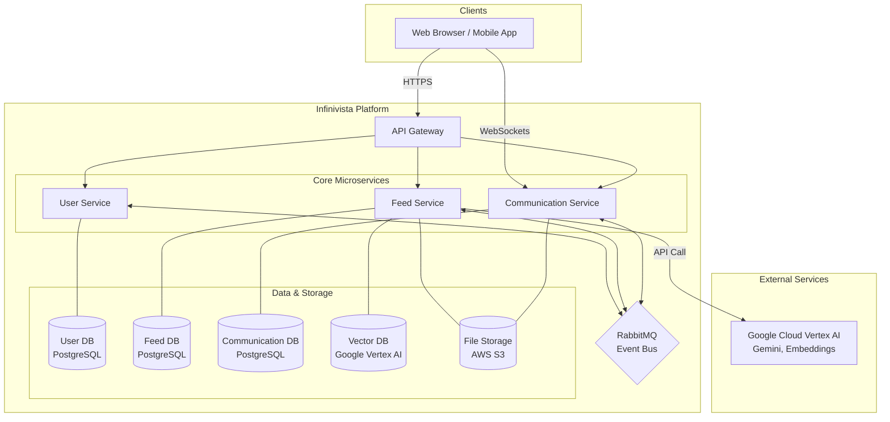

# Infinivista

Welcome to Infinivista, a modern, AI-powered social media platform built with a scalable microservices architecture. This project showcases a rich set of features, from real-time communication to intelligent content interaction, all powered by a robust and modern technology stack.

## 🏗️ System Architecture

The platform is designed using a microservices pattern, ensuring scalability, resilience, and maintainability. An API Gateway serves as the single entry point for all client requests, routing them to the appropriate downstream service. Services communicate asynchronously via a RabbitMQ event bus, promoting loose coupling and high cohesion.



---

## ✨ Key Features

Infinivista offers a comprehensive suite of features expected from a modern social network, along with unique AI-powered capabilities.

### Core Social Networking
- **User Authentication**: Secure user registration and login with email/password, plus social sign-on via Google and Facebook.
- **Profiles & Friendships**: Customizable user profiles and a complete friendship system (send, accept, manage requests).
- **Dynamic News Feed**: A personalized feed aggregating posts from friends, groups, and pages.
- **Content Creation**: Create and share rich posts with text and media attachments.
- **Engagement**: Interact with content through comments and a variety of reactions.
- **Communities**: Create, join, and manage public or private Groups and Pages to connect with others who share similar interests.

### Real-time Communication
- **Instant Messaging**: High-performance, real-time one-on-one and group chat powered by WebSockets.
- **Media Sharing**: Securely share images, videos, and other files within chats.
- **Voice & Video Calls**: Initiate and receive real-time audio and video calls, built on WebRTC for direct peer-to-peer connections.

### 🧠 AI-Powered Features
- **AI Knowledge Assistant**: Go beyond simple search. Ask complex questions in natural language and receive intelligent, context-aware answers. This feature is powered by a Retrieval-Augmented Generation (RAG) pipeline that uses Google Vertex AI to understand the query, retrieve relevant information from a knowledge base, and generate a coherent response with the Gemini Pro model.
- **AI Content Translation**: Instantly translate posts and messages into numerous languages. This feature leverages the power of Google's Gemini Pro to provide natural, high-quality translations, breaking down language barriers for a global user base.

---

## 🛠️ Technology Stack

The platform is built on a foundation of powerful and scalable technologies, chosen to support a high-performance, feature-rich application.

| Category                  | Technology / Service                                       |
| ------------------------- | ---------------------------------------------------------- |
| **Backend**               | Nest.js, TypeScript                                        |
| **Data Persistence**      | PostgreSQL, Google Vertex AI Vector Search, AWS S3         |
| **Messaging & Real-time** | RabbitMQ (Event Bus), WebSockets                           |
| **AI & Machine Learning** | Google Cloud Vertex AI (Gemini Pro, Text Embedding Models) |
| **Infrastructure**        | Docker, Docker Compose                                     |

---

<details>
<summary>🚀 Getting Started (For Developers)</summary>

### Prerequisites

- Node.js (Latest LTS version)
- Docker and Docker Compose
- Git

### Environment Setup

1.  Clone the repository:
    ```bash
    git clone https://github.com/yourusername/infinivista-backend.git
    cd infinivista-backend
    ```

2.  Create environment files:
    ```bash
    # Create .env files in each module directory
    cp api-gateway/.env.example api-gateway/.env
    cp module-user/.env.example module-user/.env
    cp module-feed/.env.example module-feed/.env
    cp module-communication/.env.example module-communication/.env
    ```

3.  Install dependencies:
    ```bash
    npm install
    cd api-gateway && npm install
    cd ../module-user && npm install
    cd ../module-feed && npm install
    cd ../module-communication && npm install
    ```

### Running the Application

1.  Start the development environment:
    ```bash
    npm run start
    ```

    This will:
    - Build and start all Docker containers
    - Set up the database
    - Start all microservices

2.  Access the services:
    - API Gateway: http://localhost:3001
    - pgAdmin: http://localhost:8888
    - RabbitMQ Management: http://localhost:15672

</details>

## 🤝 Contributing

Contributions are welcome! Please feel free to fork the repository, create a feature branch, and submit a pull request.

## 📄 License

This project is licensed under the ISC License.
